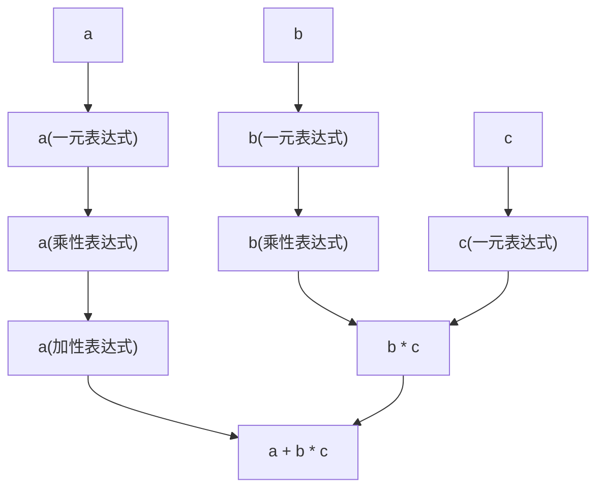
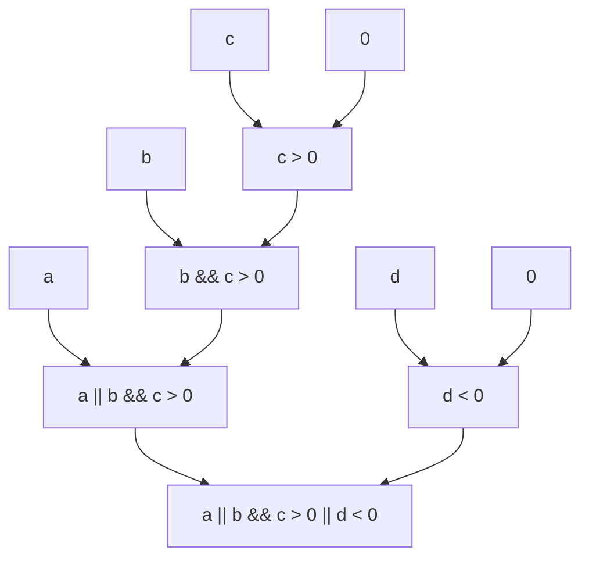
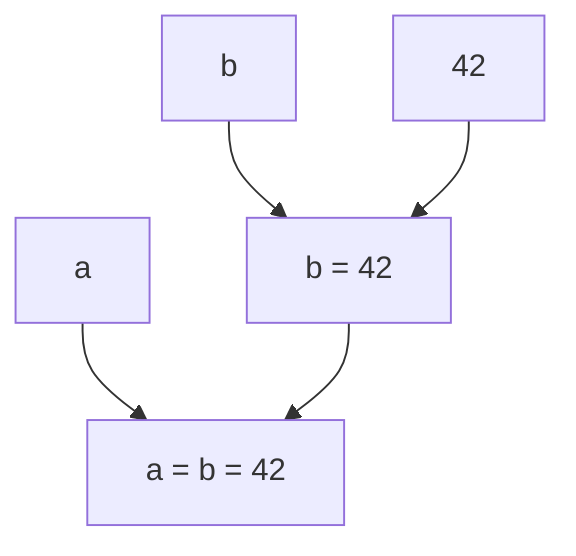

表达式是组成 C++ 程序的基本元素之一。**表达式**表示一个计算过程，可以用来计算一个值，以及产生其他影响程序状态的副作用。

在编译器处理表达式的时候，换行符如同空格一样，当做空白字符处理。因此，换行符不会影响表达式的语义。

## 操作数

表达式常常由数个表达式和一个运算符组合而成。为了方便理解，我们将这样由运算符和表达式组成的表达式，其中的表达式称为**操作数**。

对于操作数只有一个的表达式，有如下的形式：
```cpp
+a // `+` 是运算符，`a` 是操作数
```

对于运算符位于两个操作数之间的表达式，有如下的形式：
```cpp
a + b // `+` 是运算符，`a` 和 `b` 是操作数
```
其中，称运算符左边的操作数（上面的 `a`）为**左操作数**，右边的操作数（上面的 `b`）为**右操作数**。

## 未定义行为

在 C++ 中，有一些编写符合语法，但并不“正确”的程序的行为，称为**未定义行为**。标准没有规定发生未定义行为的程序应该如何运行——这样的行为可能会导致程序崩溃、产生错误的结果、或者产生其他不可预测的行为。

未定义行为常常是一种在实现和程序编写之间的妥协，当然也有一部分是历史原因遗留的错误设计。

::: info 一种奇妙的模因
在程序员圈子常常会嘲笑 C++ 的未定义行为。例如，“在作业本里写下1/0，引发了未定义行为从而骗过了老师的检查”，“输入1/0，然后我的程序把我的系统盘格式化了”。

诚然，未定义行为对于程序设计无疑会带来不少的心智负担，但现实世界里的程序天然运行在一个充满无法预测行为的环境中，与其设计一种“不存在未定义行为”的编程语言，不如想办法让程序员更好地理解未定义行为，这也正是笔者认为 C++ 这种古董语言的最大问题。
:::

## 基本表达式

基本表达式是表达式的最基本组成部分，通常而言基本表达式是一个整体。基本表达式包括：

这一节作为入门，只介绍一部分的基本表达式。

**字面量** 组成了一个基本表达式，这个基本表达式的值就是字面量的值。例如：
```cpp
42 // 整数字面量 42 组成的基本表达式，值为整数值 42
```

**标识符** 可以是一个基本表达式，它的值是标识符所代表的对象的值。例如：
```cpp
a // 标识符a组成的基本表达式，值为标识符 a 所代表的对象的值
```

**括号包围的表达式** 也是一个基本表达式，它的值是括号内表达式的值。例如：
```cpp
(42) // 括号内的整数字面量 42 组成的基本表达式，值为整数值 42
(a + b) // 括号内的表达式 a + b 组成的基本表达式，值为 a + b 的值
```
在上面这个例子里`(a + b)`是一个基本表达式，但是它里面的表达式却不是基本表达式。那么如何理解基本表达式是一个整体呢？

不妨考虑这样的结构：`(a + b) * c`，这个表达式的值是 `(a + b)` 和 `c` 进行 `*` 运算的结果，而不是 `a + (b * c)` 。这就是基本表达式是一个整体的含义，基本表达式的值只用考虑基本表达式本身，而不用考虑其他组合。

::: info 结合性、优先级与表达式组成的关系
读者可能会觉得，这不就是数学运算的优先级吗？

是的，仅考虑算术运算的话，括号的作用就像数学中一样。但是，C++ 中的表达式不仅仅是算术运算，还有很多其他的表达式，有的看起来完全不像个运算；表达式还有一些数学算式所不具有的性质，这都需要对表达式有一个更直观的理解。

因此，这里采用了表达式结构的形式来解释表达式，而不是数学运算优先级的形式。
:::
## 后缀表达式

这里暂时只介绍下列的三种后缀表达式：

- ① `基本表达式`
- ② `后缀表达式 ++`
- ③ `后缀表达式 --`

其中 `++` 表示自增运算符，`--` 表示自减运算符。由于这是后缀表达式，所以准确的说，这里的 `++` 是后缀自增运算符，`--` 是后缀自减运算符。

### 后缀自增运算符

后缀自增运算符的作用是，将操作数表示的对象加一，表达式的值是这个对象加一之前的值。例如：
```cpp
int a = 10;

a++ // 表达式 a++ 的值是 10，a 的值变为 11
```

注意， `bool` 类型不能进行自增运算。

### 后缀自减运算符

后缀自减运算符的作用是，将操作数表示的对象减一，表达式的值是这个对象减一之前的值。例如：
```cpp
int a = 10;

a-- // 表达式 a-- 的值是 10，a 的值变为 9
```

注意， `bool` 类型不能进行自减运算。

## 一元表达式

一元表达式有很多种，这里暂时只介绍其中两种与算术相关的表达式：正运算符和负运算符表达式。其形式为：

- `+ 一元表达式`
- `- 一元表达式` 
- `~ 一元表达式`
- `! 一元表达式`
- `++ 一元表达式`
- `-- 一元表达式`
- `后缀表达式`

其中 `+` 表示正运算符，`-` 表示负运算符，`~` 表示按位取反，`!` 表示逻辑非，`++` 表示前缀自增运算符，`--` 表示前缀自减运算符。

::: info 更多一元表达式
技术性地说，一元表达式形式应当是 `+ 转换表达式`、`- 转换表达式`、`后缀表达式`等。`后缀表达式` 又由`函数调用`、`数组访问`、`基本表达式`等组成。

这里为了方便理解，对一元表达式的形式做出了简化，只介绍了一元表达式的一部分。
:::

### 正运算符

目前我们只考虑 `int`、`bool`、`char` 这三种基本类型的运算。

对于 `int`，正运算符的作用是得到操作数的值。例如：
```cpp
+42 // 值为 42
```
注意，`+a`这个表达式虽然值和 `a` 一样，但是 `+a` 不同与 `a`，不再指代 `a` 所代表的对象，而是另一个和 `a` 相同的值。

### 整数提升

对于 `bool` 和 `char` 类型，正运算符会将其转换为 `int` 类型。例如：
```cpp
+true // 值为 1
+false // 值为 0
+'a' // 值为 97
```
这个转换被称为整数提升，类型大小比 `int` 小的整数类型在正运算符、负运算符的表达式中会被提升为 `int` 类型。

后面会介绍到其他的、会发生整数提升的表达式。它们遵循相同的规则，即将类型大小比 `int` 小的整数类型提升为 `int` 类型，然后进行计算。

### 负运算符

负运算符的作用是得到操作数的相反数。例如：
```cpp
-42 // 值为 -42
```
负运算符的作用和正运算符类似，同样会进行[整数提升](#整数提升)。例如：
```cpp
-true // 值为 -1
-false // 值为 0
-'a' // 值为 -97
```

此外，`-a` 表达式的值和 `a` 的值相反，但是类似与 `+a` 并不指代 `a` 这个对象，`-a` 并不会改变 `a` 的值。

### 按位取反

按位取反运算符的作用是对操作数的每一位取反。例如：
```cpp
~42 // 值为 -43
```
假设 `int` 类型是32位的，`42` 的二进制表示是`0000 0000 0000 0000 0000 0000 0010 1010`，取反后的二进制表示是`1111 1111 1111 1111 1111 1111 1101 0101`，转换为十进制就是`-43`。

类似于正运算符和负运算符，按位取反运算符也会进行[整数提升](#整数提升)。例如：
```cpp
~true // 值为 -2
~false // 值为 -1
~'a' // 值为 -98
```

### 逻辑非

逻辑非运算符的作用是对操作数取逻辑非，例如：
```cpp
!42 // 值为 0
```
逻辑非期待一个 `bool` 类型的值进行运算，所以这里 `42` 被转换为 `true`，然后取逻辑非，结果是 `false`。

### 前缀自增运算符

前缀自增运算符的作用是将操作数表示的对象加一，表达式的值是这个对象加一之后的值、且表示这个对象。例如：
```cpp
int a = 10;

++a // 表达式 ++a 的值是 11，a 的值变为 11
```

注意， `bool` 类型不能进行自增运算。

### 前缀自减运算符

前缀自减运算符的作用是将操作数表示的对象减一，表达式的值是这个对象减一之后的值、且表示这个对象。例如：
```cpp
int a = 10;

--a // 表达式 --a 的值是 9，a 的值变为 9
```

注意， `bool` 类型不能进行自减运算。

## 加性表达式和乘性表达式

加性表达式和乘性表达式组成了 C++ 中，算术表达式的主要形式。

### 乘性表达式

乘性表达式的形式是
- ①`乘性表达式 * 一元表达式`
- ②`乘性表达式 / 一元表达式`
- ③`乘性表达式 % 一元表达式`
- ④`一元表达式`

根据中间的标点符号类型，乘性表达式的计算不同。`*`表示乘法，`/` 表示除法，`%` 表示取余（模运算）。

```cpp
a * (b * c)
```
上面的例子里，`a` 是一个基本表达式，然后以上文④的形式单独组成了一个乘性表达式。`(b * c)` 也是一个基本表达式，然后 `a * (b * c)` 以上文①的形式组成了一个乘性表达式。

::: info 乘性表达式的形式
技术性地说，乘性表达式的形式中的①是 `乘性表达式 * 成员指针表达式`，②是 `乘性表达式 / 成员指针表达式`，以此类推。

从`成员指针表达式` 到 `一元表达式` 中间还有一层 `转换表达式`。

为了减少引入过多概念导致理解困难，这里简化了乘性表达式的形式。
:::

### 加性表达式

加性表达式的形式和乘性表达式很类似。加性表达式的形式是
- ①`加性表达式 + 乘性表达式`
- ②`加性表达式 - 乘性表达式`
- ③`乘性表达式`

根据中间的标点符号类型，加性表达式的计算不同。`+`表示加法，`-` 表示减法。

这时，我们已经能够组合出基本的四则运算了，例如
```cpp
a + b * c
```
利用一下上面的知识，我们可以对这个表达式做出如下的分析：
- `a`、`b`、`c` 都是基本表达式，其值分别是 `a`、`b`、`c` 所代表的对象的值。
- `b * c` 是一个乘性表达式，其值是 `b` 和 `c` 的乘法运算的结果。
- `a + b * c` 是一个加性表达式，其值是 `a` 和 `b * c` 的加法运算的结果。

可以画出一个这样的图示来理解


加性表达式的形式里面并不直接包含一元表达式，所以这里`a + b * c`的分析结果是唯一的：只能先计算 `b * c`，然后再计算 `a + b * c`。否则，就会出现`加性表达式 * 乘性表达式`的形式，这样无论是加性表达式还是乘性表达式都是不符合规定的。

### 整数的加减乘除与取余计算

在一般的情况下，C++ 中整数的加减乘除和数学上的整数运算是一致的。例如：
- `42 + 24`的值是`66`
- `42 - 24`的值是`18`
- `42 * 24`的值是`1008`
- `42 / 24`的值是`1`
- `42 % 24`的值是`18`。

::: info 整数除法
读者可能已经忘记了整数除法的规则，这里简单复习一下。

整数除法的结果是整数商，还记得“7除以2得3余1”这样的说法吗，整数除法中`42 / 24`的结果是`1`，而不是`1.75`。这里提到的余数，也即是`42 % 24`得到的`18`这个结果。
:::

对于除法运算和取余运算，如果除数为0，这个表达式的行为是[未定义行为](#未定义行为)。

类似于正运算符，加减乘除和取余运算也会进行[整数提升](#整数提升)。例如：
```cpp
true + 2 // 值为 3
'a' + 2 // 值为 100
```

注意，`int` 类型并不是数学意义上的整数，是有范围的，当整数运算的结果超出了 `int` 类型的范围时，会发生溢出。对于 `int` 类型，溢出是[未定义行为](#未定义行为)。因此，编译器可以认为绝对不会发生溢出，并依此生成代码，这将导致发生溢出时程序的行为不可预测。

## 移位表达式

移位表达式的形式是
- ①`移位表达式 << 加性表达式`
- ②`移位表达式 >> 加性表达式`
- ③`加性表达式`

其中，`<<` 表示左移，`>>` 表示右移。

### 移位表达式的计算
移位表达式计算的值是将 `<<` 或 `>>` 左边的值按照右边的值指定的比特数（位数）进行移位操作的结果。例如：
```cpp
42 << 2 // 值为 168
```
假设 `int` 是32位的，`42` 的二进制表示是 `0000 0000 0000 0000 0000 0000 0010 1010`，左移两位后的二进制表示是 `0000 0000 0000 0000 0000 0000 1010 1000` （用 `0` 补充移出来的位），转换为十进制就是 `168`。

当结果不超过范围时，读者可以简单地认为左移 `N` 位就是乘以 `2^N`。相对的，右移 `N` 位就是除以 `2^N`（向下取整）。

如果左移的结果超过范围，例如：
```cpp
42 << 30
```
`42`的二进制表示是 `0000 0000 0000 0000 0000 0000 0010 1010`，左移30位后的二进制表示是 `1000 0000 0000 0000 0000 0000 0000 0000` （超出范围的位会被舍弃），最后这个结果转换为十进制就是 `-2147483648`。

任何情况下，如果移位表达式的右操作数是负数，或者超过了左边值的位数，那么这个表达式的行为是未定义的。

类似于加性表达式，移位表达式会进行[整数提升](#整数提升)。例如：
```cpp
true << 2 // 值为 4
'a' << 2 // 值为 388
```

对于 `int` 类型的负值，右移操作在左边补充的是 `1`，而不是 `0`。例如：
```cpp
-42 >> 2 // 值为 -11
```
`-42` 的二进制表示是 `1111 1111 1111 1111 1111 1111 1101 0110`，右移两位后的二进制表示是 `1111 1111 1111 1111 1111 1111 1111 0101`，转换为十进制就是 `-11`。显然，即使是负数，右移操作也是向下取整的除以 `2^N`。需要注意，这里的除法是向下取整的，而非向零取整，即 `-42 / (2 ^ 2) = -11 ... 3`。于是，容易观察到，如果右移时，右操作数的值是左边的位数，正数会变成 `0`，而负数会变成 `-1`。

::: tip 移位强迫症
设计移位是因为在计算机中，移位操作是非常高效的。在一些情况下，移位操作可以取代乘法和除法，从而提高程序的性能。

然而，了解到这一点的程序员也会强迫自己一定要写出移位操作，这样的做法是不好的。现代编译器能够将整数乘除2的幂次方的操作优化为移位操作，所以不需要强迫自己写出移位操作。

程序员应当选择适合当前开发情况的代码，在功能开发期使用高可读性容易重构的代码，在维护优化期使用性能更高的代码。当然，我们最希望的事情是这两个目标能够并行不悖。
:::

## 关系表达式

**比较表达式**、**关系表达式**、**相等表达式**三者组成了 C++ 中的比较关系，它们的形式如下：

### 比较表达式
- ① `比较表达式 <=> 移位表达式`
- ② `移位表达式`

### 关系表达式
- ① `关系表达式 < 比较表达式`
- ② `关系表达式 > 比较表达式`
- ③ `关系表达式 <= 比较表达式`
- ④ `关系表达式 >= 比较表达式`
- ⑤ `比较表达式`

其中，`<` 表示小于，`>` 表示大于，`<=` 表示小于等于，`>=` 表示大于等于。

### 相等表达式
- ① `相等表达式 == 关系表达式`
- ② `相等表达式 != 关系表达式`
- ③ `关系表达式`

其中，`==` 表示等于，`!=` 表示不等于。注意，表示等于时，中间的运算符是两个等号 `==`，而不是一个等号 `=`。

### 关系表达式与相等表达式的计算
比较表达式和关系表达式的结果都是 `bool` 类型。例如：
```cpp
42 < 24 // 值为 false
42 > 24 // 值为 true
42 <= 42 // 值为 true
24 >= 42 // 值为 false
42 == 42 // 值为 true
42 != 42 // 值为 false
```
如果两边的表达式的类型不同，C++ 会尝试将两边转换为类型大小较大的那个类型。例如：
```cpp
'a' < 42 // 值为 false
```
这里，`'a'` 被转换为 `int` 类型，然后再进行比较。`'a'`的ASCII码是65，所以这个比较的结果是 `65 < 42`，得到 `false`。

注意，不要连用两个比较运算符，例如`24 < a < 42`。这样的表达式会导致计算 `24 < a` 的结果，得到一个 `bool` 值，然后这个值（假定为`x`）再计算 `x < 42`。这样的计算中，`bool` 被转换为 `int` 类型（因为比较的右边是 `int` 类型），结果`x`要么是`0` 要么是 `1`，然后和 `42` 比较，这显然不会得到我们想要的结果。

### 比较表达式的计算
`<=>` 表示三路比较，`<=>` 的结果是一个整数，如果左边的值小于右边的值，结果是负数；如果左边的值等于右边的值，结果是0；如果左边的值大于右边的值，结果是正数。例如：
```cpp
(42 <=> 24) > 0 // 值为 true
(42 <=> 42) == 0 // 值为 true
(24 <=> 42) < 0 // 值为 true
```
::: info 三路比较是什么？
技术性地说，`int` 类型的三路比较的结果是一个 `std::strong_ordering` 类型的值，包括 `less`、`equal`、`greater` 三个值，这三个值可以与0做比较。这里为了方便理解，简化了三路比较的结果。

`std::strong_ordering` 表达的是全序关系。对于某个具有全序关系的类型的值 `a` 、 `b` 和 `c`，有：
- 反对称性：如果 `a <= b` 且 `b <= a` 成立，那么 `a == b`。
- 传递性：如果 `a <= b` 且 `b <= c`，那么 `a <= c`。
- 反自反性：`a <= a` 总是成立。

这时候，两个数据的比较常常能够用差值的符号性来表示，这样能最大程度利用一次比较的信息量。

除了全序关系，还有偏序关系 `std::partial_ordering` 和弱序关系 `std::weak_ordering`。偏序关系允许类型中存在两个值之间没有比较关系，弱序关系则可以忽略传递性。
:::

## 按位逻辑表达式

按位逻辑表达式有三种：按位与、按位或和按位异或。

### 按位与
- ①`按位与表达式 & 相等表达式`
- ②`相等表达式`

### 按位异或
- `按位异或表达式 ^ 按位与表达式`
- `按位与表达式`

### 按位或
- ①`按位或表达式 | 按位异或表达式`
- ②`按位异或表达式`

### 按位逻辑表达式的计算

按位逻辑表达式的计算是将 `&`、`^`、`|` 左右两边的值按每一位分别进行逻辑运算的结果。

对于一个比特而言：
- 按位与的结果是两个比特都为1时结果为1，否则为0。
- 按位或的结果是两个比特都为0时结果为0，否则为1。
- 按位异或的结果是两个比特相同时结果为0，否则为1。

例如：
```cpp
42 & 24 // 值为 8
42 | 24 // 值为 58
42 ^ 24 // 值为 50
```
`42` 的二进制表示是 `0000 0000 0000 0000 0000 0000 0010 1010`，`24` 的二进制表示是 `0000 0000 0000 0000 0000 0000 0001 1000`，按位与的结果是 `0000 0000 0000 0000 0000 0000 0000 1000`，转换为十进制就是 `8`。

按位逻辑表达式会进行[整数提升](#整数提升)。例如：
```cpp
true & 2 // 值为 2
'a' | 2 // 值为 99
```

## 逻辑表达式

逻辑表达式有两种：逻辑与和逻辑或。

### 逻辑与
- ①`逻辑与表达式 && 按位或表达式`
- ②`按位或表达式`

### 逻辑或
- ①`逻辑或表达式 || 逻辑与表达式`
- ②`逻辑与表达式`

### 逻辑表达式的计算

逻辑表达式的计算是将 `&&`、`||` 左右两边的值按照逻辑运算的结果。这会将左右两边的值转换为 `bool` 类型，然后进行逻辑运算。

其中：
- 逻辑与的结果是两个值都为 `true` 时结果为 `true`，否则为 `false`。
- 逻辑或的结果是两个值都为 `false` 时结果为 `false`，否则为 `true`。

例如：
```cpp
true && false // 值为 false
true || false // 值为 true
```

注意，逻辑表达式是短路的。例如：
```cpp
false && a
```
这个表达式的值一定是 `false`，因为逻辑与的左边是 `false`。此时，C++规定不会计算右边`a`的值，直接返回 `false`。类似的，如：
```cpp
true || a
```
这个表达式的值一定是 `true`，因为逻辑或的左边是 `true`。此时，C++规定不会计算右边`a`的值，直接返回 `true`。

在之后，当我们了解到表达式的副作用时，我们会进一步讨论逻辑表达式的短路。

::: tip 逻辑表达式的计算顺序
读者可以发现，从关系表达式到逻辑表达式，有着一层一层严格的组合关系。

例如：
```cpp
a || b && c > 0 || d < 0
```
这个表达式被唯一解释为如下图的计算过程：


现在正看着这个文档的人可能会觉得这个计算顺序很明显。但是在开发的时候，每写一个表达式都要考虑计算顺序，是一件非常繁琐且降低效率的事情。

与其把时间消耗在反复训练以熟练掌握这个计算顺序，不如把时间消耗在提高代码质量上。在实际开发中，我们可以多用`()`括号，将复杂的组合表达式变为基本表达式。这样，不仅解决了计算顺序的问题，还可以提高代码的可读性。

例如，上面的表达式可以写成：
```cpp
a || (b && (c > 0)) || (d < 0)
```
这样计算顺序就变得非常明显了。

:::

## 条件表达式

C++ 中的条件表达式又叫做三目运算、三元表达式等名称，其形式是
- ① `逻辑或表达式`
- ② `逻辑或表达式 ? 表达式 : 赋值表达式`

标点符号 `?` 和 `:` 是条件表达式的标志，为了方便表述，这里将 `?` 左边的表达式称为 操作数1，将 `:` 左边、`?` 右边的表达式称为 操作数2，将 `:` 右边的表达式称为 操作数3。

条件表达式的计算是先计算操作数1，如果操作数1转换到`bool`后的值`true`，则计算操作数2，否则计算操作数3（类似于逻辑表达式的短路行为，另一个操作数不会计算）。

整个表达式的值是操作数2或操作数3的值，取决于计算了哪一个操作数。

## 赋值表达式

赋值表达式的形式是：
- ①`条件表达式`
- ②`逻辑或表达式 = 赋值表达式`

以及一系列的复合赋值表达式：
- ③`逻辑或表达式 += 赋值表达式`
- ④`逻辑或表达式 -= 赋值表达式`
- ⑤`逻辑或表达式 *= 赋值表达式`
- ⑥`逻辑或表达式 /= 赋值表达式`
- ⑦`逻辑或表达式 %= 赋值表达式`
- ⑧`逻辑或表达式 <<= 赋值表达式`
- ⑨`逻辑或表达式 >>= 赋值表达式`
- ⑩`逻辑或表达式 &= 赋值表达式`
- ⑪`逻辑或表达式 ^= 赋值表达式`
- ⑫`逻辑或表达式 |= 赋值表达式`

### 赋值表达式的计算
赋值是 C++ 中一种操作的名称，对于 `int`、`bool`、`char` 这三种基本类型，赋值的操作是将一个对象的值改变为另一个值。例如：
```cpp
a = 42
```
这个表达式的作用是将 `a` 的值改变为 `42`。对于②形式的赋值表达式，其计算是先计算右边的赋值表达式，然后将计算结果赋值给左边的逻辑或表达式。

::: info 等于号
在数学中，等于号有很多含义，例如定义函数、表示等价、表示等于关系。但是在 C++ 中，等于号的含义是赋值。这个含义与数学中任何含义都不同，对于初学者需要注意。
:::

赋值表达式的值是赋值完成后 `=` 左边的值。例如：
```cpp
a = 42 // 表达式的值为 42，并表示 a 这个对象
```

这意味着可以写出如下的表达式：
```cpp
(a = 42) = 24
```
这里 `a` 先被赋值为 `42`，然后再被赋值为 `24`。这个表达式的值是 `24`。

注意，赋值表达式的组合方式和前面的表达式不同。例如，加性表达式的结构是

- ①`加性表达式 + 乘性表达式`

这里加性表达式在左边，乘性表达式在右边。而赋值表达式的结构是

- ②`逻辑或表达式 = 赋值表达式`

这里赋值表达式在左边，逻辑或表达式在右边。

考虑如下的表达式：
```cpp
a = b = 42
```
这个赋值表达式的结构实际上是

也即是说，这个表达式会先计算 `b = 42`，然后再计算 `a = b = 42`。也即从右往左计算的。

### 复合赋值表达式

复合赋值表达式是复合操作的赋值表达式，例如：
```cpp
a += 42
```
等价于
```cpp
a = a + 42
```

技术性地说，对于 `op` 运算符，`a op= b` 等价于 `a = a op b`。除了这里的 `a` 表达式只计算一次，其他的计算过程和先计算再赋值时是一样的。

### 副作用

在 C++ 中，表达式的计算可能会产生副作用，副作用会影响表达式以外的程序部分。

除了赋值表达式，前面介绍过的[前缀自增运算符](#前缀自增运算符)、[前缀自减运算符](#前缀自减运算符)、[后缀自增运算符](#后缀自增运算符)、[后缀自减运算符](#后缀自减运算符)也能产生副作用。例如：
```cpp
b = (a = 42) + 24
```
这个表达式除了会改变 `b` 的值，还会改变 `a` 的值。这里的 `a = 42` 是一个赋值表达式，它的值是 `42`，然后再计算 `42 + 24`，最后将结果 `66` 赋值给 `b`。

赋值表达式规定了先计算右边的表达式，再计算左边的表达式，最后进行赋值。这样的规定使得如`a += a += 1`这样的表达式是符合语法的，这里的计算过程是先计算右边的`a += 1`，得到这个表达式的值`x`，然后再计算左边的`a += x`。但显然这样的表达式的可读性比较糟糕，在开发中应当避免这样使用。

在前面逻辑表达式的短路中，我们提到了逻辑表达式的短路行为。这种短路行为会导致逻辑表达式的副作用不会发生。例如：
```cpp
false && (a = 42)
```
这个表达式的值是 `false`，并且 `a = 42` 不会计算，`a` 的值不会改变。类似的：
```cpp
true || (a = 42)
```
这个表达式的值是 `true`，并且 `a = 42` 不会计算，`a` 的值不会改变。

### 不确定值

在初识声明的[不确定值](./declaration.md#不确定值)一节中提到，如果一个对象声明时没有初始化器，则会初始化为不确定值。

虽然不能使用具有不确定值的对象的值，但是可以对其进行赋值。例如：
```cpp
int a; // a 的值是不确定的
// int b = a; // [!code error] // 错误，不能使用 a 的值
a = 42; // 可以对 a 进行赋值
int b = a; // 现在 a 的值是确定的，可以使用 a 的值了
```

### 能不能赋值？

赋值表达式的左边并不能是任意的表达式，例如
```cpp
a + b = 42 // [!code error] // 错误
```
这是因为 `a + b` 得到的是一个临时的值，并不指代对象，所以不能对其赋值。赋值表达式的左边必须是一个能够指代对象的表达式。

在这一节中，已经提到了前缀自增、前缀自减、赋值表达式、复合赋值表达式等表达式的值是能指代对象的。这意味着下面的表达式是符合语法的：
```cpp
int a = 0;
int b = 0;

++a = 42; // 符合语法
a = b += 42; // 符合语法
```

相对的后缀自增、后缀自减、取反运算符等表达式会导致表达式不再能赋值。注意，[正运算符](#正运算符)对于 `int` 类型虽然不会让值发生变化，但也是如此。例如：
```cpp
int a = 0;
a++ = 42;  // [!code error] // 错误
a-- = 42;  // [!code error] // 错误
~a = 42;  // [!code error] // 错误
+a = 42;  // [!code error] // 错误
```

此外，前缀自增、前缀自减、后缀自增、后缀自减等表达式对参数做出修改，性质上也是赋值。这意味着其操作数如果不是可赋值的，则会产生错误。
```cpp
++(+a);  // [!code error] // 错误
```

::: info 前缀与后缀的差异
前缀自增、前缀自减、后缀自增、后缀自减的差异是延续自 C 语言的设计。

早年编译器优化能力的匮乏使得程序员之间流传着 “后缀自增会产生一个临时对象从而损失性能” 的传说，在 21 世纪，这种传说已经不再成立。

自增自减的这种差异也常常会带来阅读上的困扰，因此在实际开发中，应当尽可能简略且明确地使用自增自减，避免把它结合进复杂的表达式中。
:::

此外，如果 `()` 内的表达式是能指代对象的，那么这个基础表达式也指代这个对象，从而可以赋值。例如：
```cpp
(a) = 42; // 符合语法
```

此外，如果[条件表达式](#条件表达式)的操作数2和操作数3能指代对象，且是相同的类型，那么条件表达式的值也是能指代对象的。例如：
```cpp
int a = 0;
int b = 0;

(true ? a : b) = 42; // 符合语法
```

注意，赋值表达式左边不能直接是条件表达式，需要使用括号将它变成基础表达式

## 逗号表达式

逗号表达式的形式是

- ①`逗号表达式 , 赋值表达式`
- ②`赋值表达式`

这里将逗号表达式中，','的左边称为操作数1，右边称为操作数2。

逗号表达式的计算是先计算操作数1，然后计算操作数2，最后返回操作数2的值。例如：
```cpp
a = 42, a // 值为 42
```

逗号表达式也可以连续使用，例如：
```cpp
a = 42, b = 24, c = 66 // 值为 66
```
::: info
注意，在特定语境下，逗号不会被解释为逗号表达式。例如：
```cpp
int a = 42, b = 24;
```
这里的逗号不是逗号表达式，而是用来分隔不同的声明的。

除此之外还有函数调用、初始化列表等语境下，逗号也不会被解释为逗号表达式。这些内容会在后续章节中介绍。
:::

## 无法确定顺序的副作用

在本节前面的内容中，介绍了一些有序的表达式，例如赋值表达式、复合赋值表达式、逗号表达式等。这样的表达式中，出现了多个对相同对象的副作用时，其作用是确定的，例如：

```cpp
int i = 1;

i = ++i + 2 // i 的值是 4
```
这里的赋值表达式，先计算左边表达式，再计算右边表达式，最后赋值。其计算过程是：
1. 先计算左边，`i` 表达式的值是 `1`，且表示 `i` 对象。
2. 再计算右边，`++i + 2` 表达式的值是 `4`，发生副作用，`i` 的值变为 `2`。
3. 最后赋值，`i` 的值变为 `4`。

但是，并不是所有的表达式都是有序的。例如：
```cpp
++i + i++
```
这里 `++i` 和 `i++` 都会对 `i` 产生副作用，但是 C++ 规定 `+` 两边的表达式的计算是无顺序的。

对这样的表达式求值是错误的，无论是在学习还是在实际开发中，都应当避免写出这样的表达式。

## 进一步理解初始化
在前文，我们提到初始化的概念，声明并初始化的语法结构是：`类型 标识符 初始化器;`

之前我们认为初始化器是`= 字面量`，例如`int a = 42;`，`= 42`就是初始化器。现在，我们可以进一步理解初始化器，初始化器可以是`= 赋值表达式`。例如：
```cpp
int a = 42;
int b = 42 + a;
```
这里b的初始化器是`= 42 + a`，这个初始化器是`= 表达式`，这个生命会将`b`指代的对象初始化为`42 + a`的值。

初始化器中能出现赋值表达式（当然也因此而包括了赋值表达式所有的组件）。这意味着下列代码是符合语法的：
```cpp
int a = 42;
int b = a = 24;
```

此外，由于初始化器是`= 赋值表达式`，所以初始化器中不能出现逗号表达式。初始化器中的逗号有另外的含义，例如：
```cpp
int a = 42, b = 24;
```
这里的逗号不是逗号表达式，而是分隔了两个声明。这里分别声明了`a`和`b`，并分别初始化为`42`和`24`。

我们可以把以下两种形式统称为初始化声明
- `标识符`
- `标识符 = 赋值表达式`

那么，初始化就可以理解为

`类型 初始化声明 , 初始化声明 , 初始化声明 ... ;`

这样的结构，到此已经基本接近了完整的 C++ 初始化语法。

## 快速练习

<Choices 
    :questions="[
        {
            text: '下面的表达式的值是',
            code: '42 > 24 > 12',
            shuffleOptions: false,
            options: ['true', 'false', '语法错误'],
            answers: ['false']
        },
        {
            text: '下面的表达式的值是',
            code: 'true + true',
            shuffleOptions: false,
            options: ['2', '1','0', 'true', 'false', '语法错误'],
            answers: ['2']
        },
        {
            text: '下面的表达式的值是',
            code: '1 << \'\\n\'',
            shuffleOptions: false,
            options: ['1024', '128','10', '1', '0', '语法错误'],
            answers: ['1024']
        }
    ]"/>