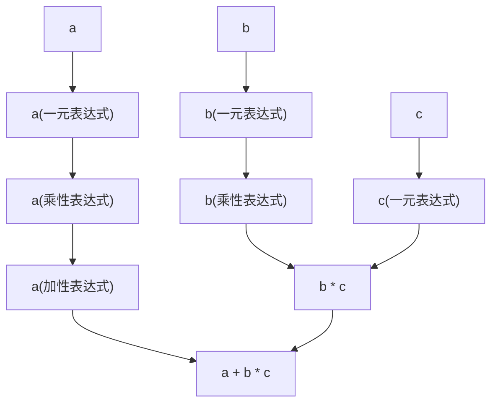

加性表达式和乘性表达式组成了 C++ 中，算术表达式的主要形式。

### 乘性表达式

乘性表达式的形式是
- `乘性表达式 * 一元表达式`
- `乘性表达式 / 一元表达式`
- `乘性表达式 % 一元表达式`
- `一元表达式`

根据中间的标点符号类型，乘性表达式的计算不同。`*`表示乘法，`/` 表示除法，`%` 表示取余（模运算）。

```cpp
a * (b * c)
```
上面的例子里，`a` 是一个基本表达式，然后以上文④的形式单独组成了一个乘性表达式。`(b * c)` 也是一个基本表达式，然后 `a * (b * c)` 以上文①的形式组成了一个乘性表达式。

::: info 乘性表达式的形式
技术性地说，乘性表达式的形式中的①是 `乘性表达式 * 成员指针表达式`，②是 `乘性表达式 / 成员指针表达式`，以此类推。

从`成员指针表达式` 到 `一元表达式` 中间还有一层 `转换表达式`。

为了减少引入过多概念导致理解困难，这里简化了乘性表达式的形式。
:::

### 加性表达式

加性表达式的形式和乘性表达式很类似。加性表达式的形式是
- `加性表达式 + 乘性表达式`
- `加性表达式 - 乘性表达式`
- `乘性表达式`

根据中间的标点符号类型，加性表达式的计算不同。`+`表示加法，`-` 表示减法。

这时，我们已经能够组合出基本的四则运算了，例如
```cpp
a + b * c
```
利用一下上面的知识，我们可以对这个表达式做出如下的分析：
- `a`、`b`、`c` 都是基本表达式，其值分别是 `a`、`b`、`c` 所代表的对象的值。
- `b * c` 是一个乘性表达式，其值是 `b` 和 `c` 的乘法运算的结果。
- `a + b * c` 是一个加性表达式，其值是 `a` 和 `b * c` 的加法运算的结果。

可以画出一个这样的图示来理解


加性表达式的形式里面并不直接包含一元表达式，所以这里`a + b * c`的分析结果是唯一的：只能先计算 `b * c`，然后再计算 `a + b * c`。否则，就会出现`加性表达式 * 乘性表达式`的形式，这样无论是加性表达式还是乘性表达式都是不符合规定的。

### 整数的加减乘除与取余计算

在一般的情况下，C++ 中整数的加减乘除和数学上的整数运算是一致的。例如：
- `42 + 24`的值是`66`
- `42 - 24`的值是`18`
- `42 * 24`的值是`1008`
- `42 / 24`的值是`1`
- `42 % 24`的值是`18`。

::: info 整数除法
读者可能已经忘记了整数除法的规则，这里简单复习一下。

整数除法的结果是整数商，还记得“7除以2得3余1”这样的说法吗，整数除法中`42 / 24`的结果是`1`，而不是`1.75`。这里提到的余数，也即是`42 % 24`得到的`18`这个结果。
:::

对于除法运算和取余运算，如果除数为0，这个表达式的行为是[未定义行为](#未定义行为)。

类似于正运算符，加减乘除和取余运算也会进行[整数提升](./brief.md#整数提升)。例如：
```cpp
true + 2 // 值为 3
'a' + 2 // 值为 100
```

注意，`int` 类型并不是数学意义上的整数，是有范围的，当整数运算的结果超出了 `int` 类型的范围时，会发生溢出。对于 `int` 类型，溢出是[未定义行为](#未定义行为)。因此，编译器可以认为绝对不会发生溢出，并依此生成代码，这将导致发生溢出时程序的行为不可预测。

<Choices 
    :questions="[
        {
            text: '下面的表达式的值是',
            code: 'true + true',
            shuffleOptions: false,
            options: ['2', '1','0', 'true', 'false', '语法错误'],
            answers: ['2']
        }
    ]"/>