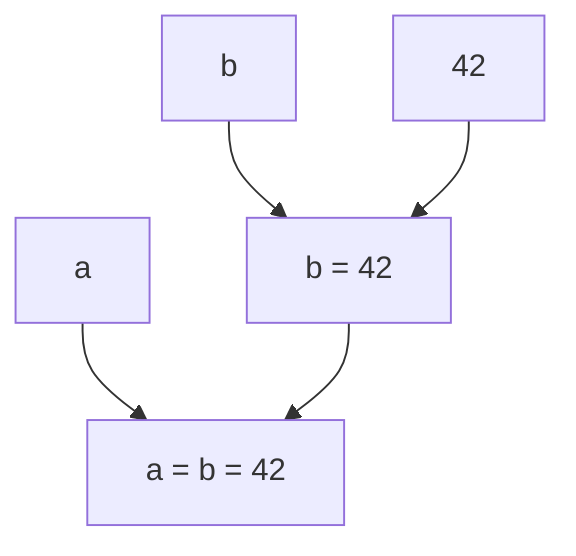

赋值表达式的形式是：
- `条件表达式`
- `逻辑或表达式 = 赋值表达式`

以及一系列的复合赋值表达式：
- `逻辑或表达式 += 赋值表达式`
- `逻辑或表达式 -= 赋值表达式`
- `逻辑或表达式 *= 赋值表达式`
- `逻辑或表达式 /= 赋值表达式`
- `逻辑或表达式 %= 赋值表达式`
- `逻辑或表达式 <<= 赋值表达式`
- `逻辑或表达式 >>= 赋值表达式`
- `逻辑或表达式 &= 赋值表达式`
- `逻辑或表达式 ^= 赋值表达式`
- `逻辑或表达式 |= 赋值表达式`

### 赋值表达式的计算
赋值是 C++ 中一种操作的名称，对于 `int`、`bool`、`char` 这三种基本类型，赋值的操作是将一个对象的值改变为另一个值。例如：
```cpp
a = 42
```
这个表达式的作用是将 `a` 的值改变为 `42`。对于②形式的赋值表达式，其计算是先计算右边的赋值表达式，然后将计算结果赋值给左边的逻辑或表达式。

::: info 等于号
在数学中，等于号有很多含义，例如定义函数、表示等价、表示等于关系。但是在 C++ 中，等于号的含义是赋值。这个含义与数学中任何含义都不同，对于初学者需要注意。
:::

赋值表达式的值是赋值完成后 `=` 左边的值。例如：
```cpp
a = 42 // 表达式的值为 42，并表示 a 这个对象
```

这意味着可以写出如下的表达式：
```cpp
(a = 42) = 24
```
这里 `a` 先被赋值为 `42`，然后再被赋值为 `24`。这个表达式的值是 `24`。

注意，赋值表达式的组合方式和前面的表达式不同。例如，加性表达式的结构是

- `加性表达式 + 乘性表达式`

这里加性表达式在左边，乘性表达式在右边。而赋值表达式的结构是

- `逻辑或表达式 = 赋值表达式`

这里赋值表达式在左边，逻辑或表达式在右边。

考虑如下的表达式：
```cpp
a = b = 42
```
这个赋值表达式的结构实际上是

也即是说，这个表达式会先计算 `b = 42`，然后再计算 `a = b = 42`。也即从右往左计算的。

### 复合赋值表达式

复合赋值表达式是复合操作的赋值表达式，例如：
```cpp
a += 42
```
等价于
```cpp
a = a + 42
```

技术性地说，对于 `op` 运算符，`a op= b` 等价于 `a = a op b`。除了这里的 `a` 表达式只计算一次，其他的计算过程和先计算再赋值时是一样的。

### 副作用

在 C++ 中，表达式的计算可能会产生副作用，副作用会影响表达式以外的程序部分。

除了赋值表达式，前面介绍过的[前缀自增运算符](#前缀自增运算符)、[前缀自减运算符](#前缀自减运算符)、[后缀自增运算符](#后缀自增运算符)、[后缀自减运算符](#后缀自减运算符)也能产生副作用。例如：
```cpp
b = (a = 42) + 24
```
这个表达式除了会改变 `b` 的值，还会改变 `a` 的值。这里的 `a = 42` 是一个赋值表达式，它的值是 `42`，然后再计算 `42 + 24`，最后将结果 `66` 赋值给 `b`。

赋值表达式规定了先计算右边的表达式，再计算左边的表达式，最后进行赋值。这样的规定使得如`a += a += 1`这样的表达式是符合语法的，这里的计算过程是先计算右边的`a += 1`，得到这个表达式的值`x`，然后再计算左边的`a += x`。但显然这样的表达式的可读性比较糟糕，在开发中应当避免这样使用。

在前面逻辑表达式的短路中，我们提到了逻辑表达式的短路行为。这种短路行为会导致逻辑表达式的副作用不会发生。例如：
```cpp
false && (a = 42)
```
这个表达式的值是 `false`，并且 `a = 42` 不会计算，`a` 的值不会改变。类似的：
```cpp
true || (a = 42)
```
这个表达式的值是 `true`，并且 `a = 42` 不会计算，`a` 的值不会改变。

### 不确定值

在初识声明的[不确定值](./declaration.md#不确定值)一节中提到，如果一个对象声明时没有初始化器，则会初始化为不确定值。

虽然不能使用具有不确定值的对象的值，但是可以对其进行赋值。例如：
```cpp
int a; // a 的值是不确定的
// int b = a; // [!code error] // 错误，不能使用 a 的值
a = 42; // 可以对 a 进行赋值
int b = a; // 现在 a 的值是确定的，可以使用 a 的值了
```

### 能不能赋值？

赋值表达式的左边并不能是任意的表达式，例如
```cpp
a + b = 42 // [!code error] // 错误
```
这是因为 `a + b` 得到的是一个临时的值，并不指代对象，所以不能对其赋值。赋值表达式的左边必须是一个能够指代对象的表达式。

在这一节中，已经提到了前缀自增、前缀自减、赋值表达式、复合赋值表达式等表达式的值是能指代对象的。这意味着下面的表达式是符合语法的：
```cpp
int a = 0;
int b = 0;

++a = 42; // 符合语法
a = b += 42; // 符合语法
```

相对的后缀自增、后缀自减、取反运算符等表达式会导致表达式不再能赋值。注意，[正运算符](#正运算符)对于 `int` 类型虽然不会让值发生变化，但也是如此。例如：
```cpp
int a = 0;
a++ = 42;  // [!code error] // 错误
a-- = 42;  // [!code error] // 错误
~a = 42;  // [!code error] // 错误
+a = 42;  // [!code error] // 错误
```

此外，前缀自增、前缀自减、后缀自增、后缀自减等表达式对参数做出修改，性质上也是赋值。这意味着其操作数如果不是可赋值的，则会产生错误。
```cpp
++(+a);  // [!code error] // 错误
```

::: info 前缀与后缀的差异
前缀自增、前缀自减、后缀自增、后缀自减的差异是延续自 C 语言的设计。

早年编译器优化能力的匮乏使得程序员之间流传着 “后缀自增会产生一个临时对象从而损失性能” 的传说，在 21 世纪，这种传说已经不再成立。

自增自减的这种差异也常常会带来阅读上的困扰，因此在实际开发中，应当尽可能简略且明确地使用自增自减，避免把它结合进复杂的表达式中。
:::

此外，如果 `()` 内的表达式是能指代对象的，那么这个基础表达式也指代这个对象，从而可以赋值。例如：
```cpp
(a) = 42; // 符合语法
```

此外，如果[条件表达式](#条件表达式)的操作数2和操作数3能指代对象，且是相同的类型，那么条件表达式的值也是能指代对象的。例如：
```cpp
int a = 0;
int b = 0;

(true ? a : b) = 42; // 符合语法
```

注意，赋值表达式左边不能直接是条件表达式，需要使用括号将它变成基础表达式
