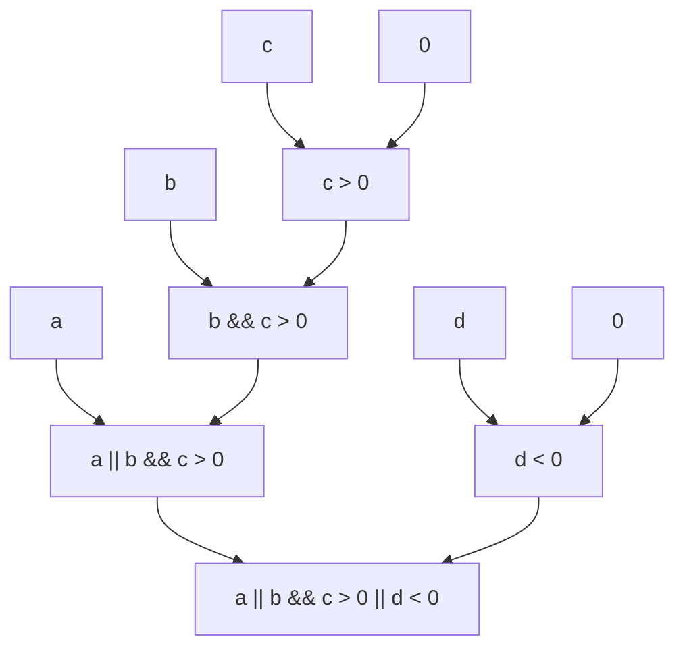

## 按位逻辑表达式

按位逻辑表达式有三种：按位与、按位或和按位异或。

### 按位与
- `按位与表达式 & 相等表达式`
- `相等表达式`

### 按位异或
- `按位异或表达式 ^ 按位与表达式`
- `按位与表达式`

### 按位或
- `按位或表达式 | 按位异或表达式`
- `按位异或表达式`

### 按位逻辑表达式的计算

按位逻辑表达式的计算是将 `&`、`^`、`|` 左右两边的值按每一位分别进行逻辑运算的结果。

对于一个比特而言：
- 按位与的结果是两个比特都为1时结果为1，否则为0。
- 按位或的结果是两个比特都为0时结果为0，否则为1。
- 按位异或的结果是两个比特相同时结果为0，否则为1。

例如：
```cpp
42 & 24 // 值为 8
42 | 24 // 值为 58
42 ^ 24 // 值为 50
```
`42` 的二进制表示是 `0000 0000 0000 0000 0000 0000 0010 1010`，`24` 的二进制表示是 `0000 0000 0000 0000 0000 0000 0001 1000`，按位与的结果是 `0000 0000 0000 0000 0000 0000 0000 1000`，转换为十进制就是 `8`。

按位逻辑表达式会进行[整数提升](./brief.md#整数提升)。例如：
```cpp
true & 2 // 值为 2
'a' | 2 // 值为 99
```

## 逻辑表达式

逻辑表达式有两种：逻辑与和逻辑或。

### 逻辑与
- `逻辑与表达式 && 按位或表达式`
- `按位或表达式`

### 逻辑或
- `逻辑或表达式 || 逻辑与表达式`
- `逻辑与表达式`

### 逻辑表达式的计算

逻辑表达式的计算是将 `&&`、`||` 左右两边的值按照逻辑运算的结果。这会将左右两边的值转换为 `bool` 类型，然后进行逻辑运算。

其中：
- 逻辑与的结果是两个值都为 `true` 时结果为 `true`，否则为 `false`。
- 逻辑或的结果是两个值都为 `false` 时结果为 `false`，否则为 `true`。

例如：
```cpp
true && false // 值为 false
true || false // 值为 true
```

注意，逻辑表达式是短路的。例如：
```cpp
false && a
```
这个表达式的值一定是 `false`，因为逻辑与的左边是 `false`。此时，C++规定不会计算右边`a`的值，直接返回 `false`。类似的，如：
```cpp
true || a
```
这个表达式的值一定是 `true`，因为逻辑或的左边是 `true`。此时，C++规定不会计算右边`a`的值，直接返回 `true`。

在之后，当我们了解到表达式的副作用时，我们会进一步讨论逻辑表达式的短路。

::: tip 逻辑表达式的计算顺序
读者可以发现，从关系表达式到逻辑表达式，有着一层一层严格的组合关系。

例如：
```cpp
a || b && c > 0 || d < 0
```
这个表达式被唯一解释为如下图的计算过程：


现在正看着这个文档的人可能会觉得这个计算顺序很明显。但是在开发的时候，每写一个表达式都要考虑计算顺序，是一件非常繁琐且降低效率的事情。

与其把时间消耗在反复训练以熟练掌握这个计算顺序，不如把时间消耗在提高代码质量上。在实际开发中，我们可以多用`()`括号，将复杂的组合表达式变为基本表达式。这样，不仅解决了计算顺序的问题，还可以提高代码的可读性。

例如，上面的表达式可以写成：
```cpp
a || (b && (c > 0)) || (d < 0)
```
这样计算顺序就变得非常明显了。

:::
